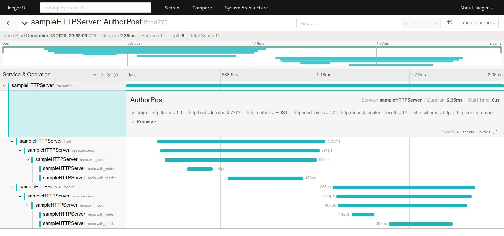

# OpenTelemetry Golang net/http + go-redis example


This demo showcases OpenTelemetry distributed tracing of a sample 
Golang HTTP App that uses a Redis backend, 
using W3C TraceContext as the de-facto standard for trace propagation across process boundaries.

This setup relies on Jaeger to receive and visualize traces. 

Make sure to check https://opentelemetry.io/docs/go/ for further reference and examples.
 
## 1 ) How to build and the sample app using docker 
```
git clone github.com/filipecosta90/opentelemetry-go-http-sample
cd opentelemetry-go-http-sample
make build-docker
make start-docker
```


## 2 ) Generating sample traces
You should now jave your sample app listening on port :7777, redis on port :6379, 
and Jaeger on ports :14268, :16686.
Let's generate some sample traces:

```
$ curl -X POST -d "{\"Name\":\"John Doe\", \"Username\":\"johndoe\", \"About\":\"Redis Geek\"}" http://localhost:7777/author/1
$ curl -X GET http://localhost:7777/author/1
```

## 3) Go look for your traces!
 
The Jaeger visualization URL is at (notice the port number):

http://[hostname]:16686/search 
 
Put in `sampleHTTPServer` value into the service name, and search for your recent traces!
Click one, and you should see the following:
 

